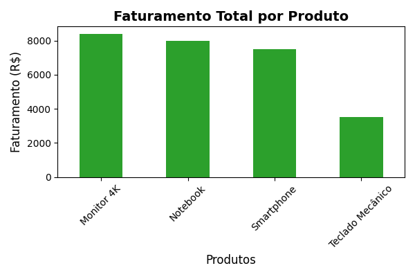

# 📊 Sistema Automatizado de BI e Relatórios Comerciais

Este é um sistema de Business Intelligence (BI) e automação de ponta a ponta desenvolvido em Python. O objetivo do projeto é eliminar o trabalho manual de consolidação de dados de filiais e envio de relatórios gerenciais para a diretoria.

## 🚀 Funcionalidades
* **Consolidação Inteligente:** Varre e unifica dados de múltiplas planilhas Excel automaticamente.
* **Análise de Dados:** Calcula faturamento global, produtos campeões e regiões líderes usando Pandas.
* **Visualização Estatística:** Gera gráficos de barras modernos para análise de desempenho.
* **Relatório Profissional:** Estrutura e exporta os resultados consolidados em formato PDF.
* **Disparo Automatizado:** Conecta-se de forma segura aos servidores de e-mail para entregar o relatório final.

## 🛠️ Tecnologias Utilizadas
* **Python** (Linguagem principal)
* **Pandas** (Tratamento e consolidação de dados)
* **Matplotlib** (Geração de gráficos visuais)
* **FPDF2** (Construção estruturada do relatório em PDF)
* **SMTPLib** (Protocolo de comunicação e disparo de e-mails)

## 📊 Resultado Visual do Desempenho
Abaixo está o gráfico gerado automaticamente pelo robô na última execução:

---
*Projeto desenvolvido como parte do meu portfólio de transição de carreira para a área de Tecnologia.*
